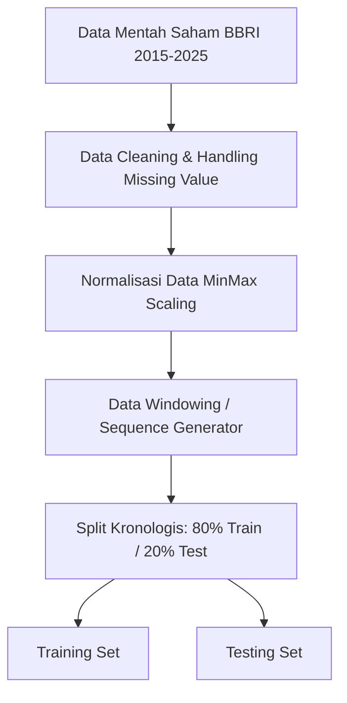

# Arsitektur & Skema Model

Dokumen ini berisi rancangan arsitektur pemrosesan data dan pemodelan untuk perbandingan LSTM vs XGBoost.

## 1. Alur Pemrosesan Data (Pipeline)



## 2. Arsitektur Model LSTM

```mermaid
graph TD
    A[Input Layer: 3D Tensor [Batch, Time Steps, Features]] --> B[LSTM Layer 1]
    B --> C[Dropout Layer 1]
    C --> D[LSTM Layer 2 (Optional)]
    D --> E[Dropout Layer 2 (Optional)]
    E --> F[Dense Output Layer: 1 Unit (Linear)]
```

## 3. Desain Model XGBoost (Baseline)
Model baseline dirancang menggunakan pohon keputusan tergradasi (gradient boosted trees) di mana regresi dilakukan dengan menjumlahkan kontribusi prediksi dari setiap estimator pohon linear.

## 4. Hyperparameter Target

### Model LSTM
* **Time Steps:** 30 atau 60 (sesuai pengujian)
* **LSTM Units:** 50, 100
* **Dropout Rate:** 0.2
* **Optimizer:** Adam
* **Epochs:** Max 100 dengan Early Stopping

### Model XGBoost
* **max_depth:** 3, 5, 7
* **learning_rate:** 0.01, 0.05, 0.1
* **n_estimators:** 100, 500, 1000
