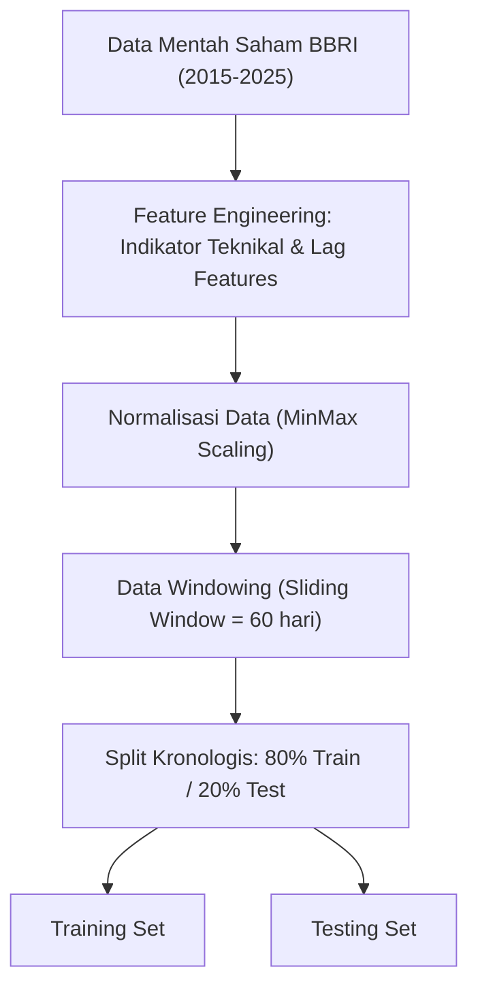
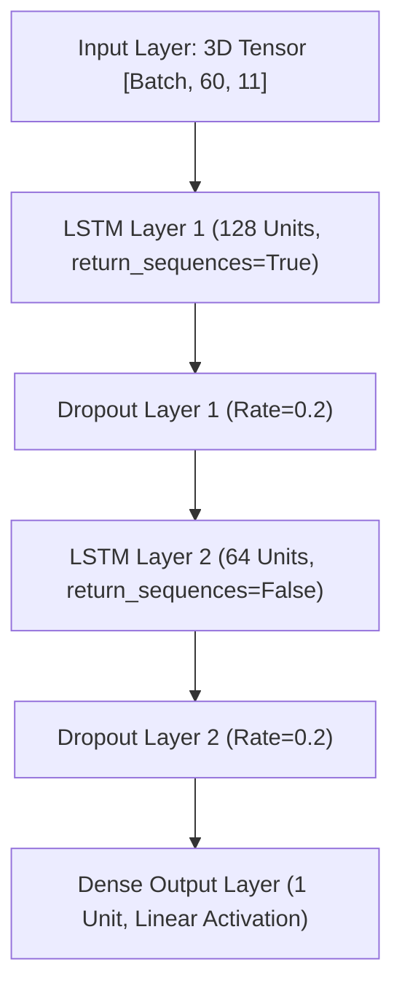
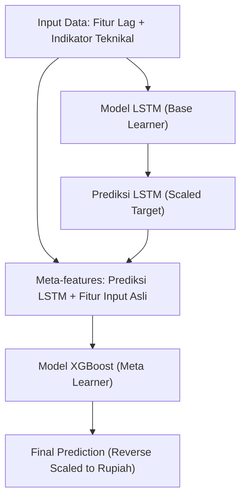

# Arsitektur & Skema Model

Dokumen ini berisi rancangan arsitektur pemrosesan data, skema model LSTM, XGBoost, dan Hybrid Stacking.

## 1. Alur Pemrosesan Data (Pipeline)

## 2. Arsitektur Model LSTM (Deep Learning)

## 3. Arsitektur Model Hybrid Stacking (LSTM → XGBoost)

Model hybrid dirancang menggunakan arsitektur stacking dua tingkat (two-level stacking classifier/regressor):
- **Level 1 (Base Learner):** Model LSTM dilatih secara independen pada dataset training untuk memprediksi nilai target scaled. Prediksi LSTM pada training set dan testing set diambil sebagai representasi fitur temporal baru.
- **Level 2 (Meta Learner):** Model XGBoost dilatih menggunakan fitur-fitur lag, indikator teknikal, ditambah dengan fitur keluaran prediksi Level 1 dari LSTM. XGBoost belajar meminimalkan sisa kesalahan (residual error) dari LSTM.

## 4. Hyperparameter Eksperimen Riil

### Model LSTM Baseline
* **Time Steps (Window):** 60 hari
* **LSTM Layer 1:** 128 units (Huber Loss, Adam Optimizer $\eta = 0.001$)
* **LSTM Layer 2:** 64 units
* **Dropout Rate:** 0.2
* **Epochs:** Max 100 dengan Early Stopping (patience=15)
* **Batch Size:** 32

### Model XGBoost Baseline
* **max_depth:** 6
* **learning_rate:** 0.05
* **n_estimators:** 500
* **subsample:** 0.8
* **colsample_bytree:** 0.8

### Model XGBoost Meta-Learner (Hybrid Stacking)
* **max_depth:** 5
* **learning_rate:** 0.03
* **n_estimators:** 600
* **subsample:** 0.8
* **colsample_bytree:** 0.7
* **early_stopping_rounds:** 30
